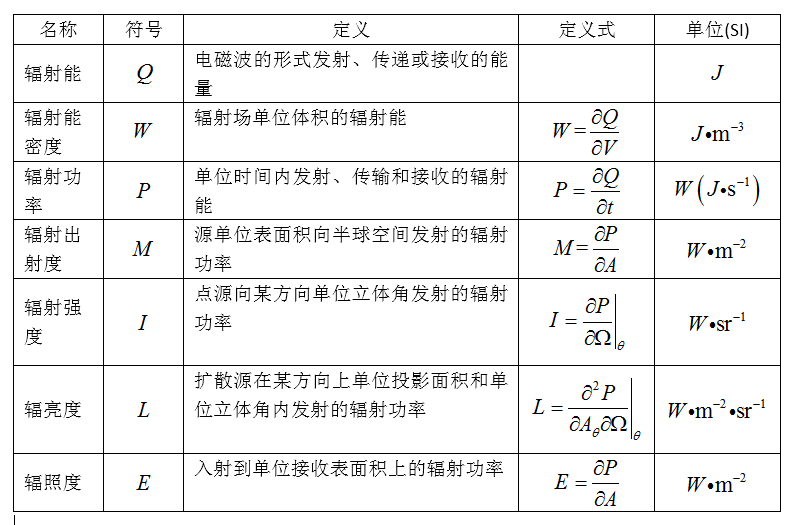
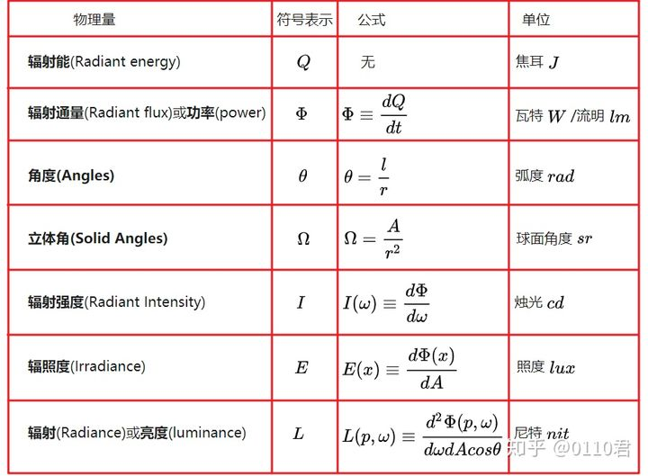
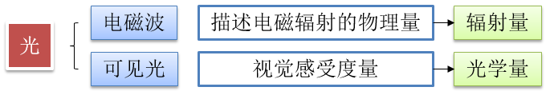
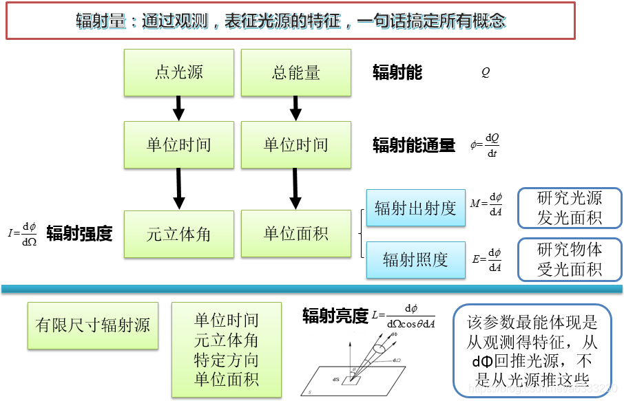
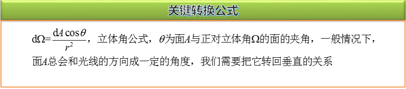

# A 辐射相关的物理知识

参考文章:

1. [整体讲解](https://zhuanlan.zhihu.com/p/139468429)
2. [立体角](https://www.qiujiawei.com/solid-angle/)

辐射功率 也称为 辐射能通量

*[来源](https://blog.csdn.net/a6333230/article/details/82968484)*

*来源于上面的整体讲解文章*

*[来源](https://blog.csdn.net/a6333230/article/details/90036993)*

